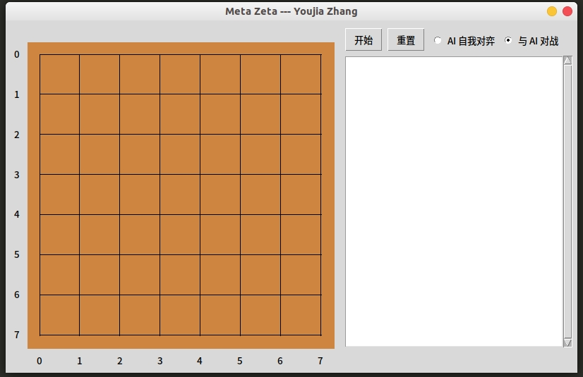

# Meta-Zeta
这是一个基于强化学习的自我对弈模型，运行之后的程序如下图所示。

<div align=center>

</div>

## 运行代码
```
python3 MetaZeta.py
```

## 文件结构

|文件名|类型|描述|     
|-|-|-|
|`TreeNode.py`|**MCTS**| MCTS 决策树的节点| 
|`MCTS.py`|**MCTS**|构建 MCTS 决策树|  
|`AIplayer.py`|**MCTS**|构建一个基于 MCTS+NN 的 AI|  
|`Board.py`|**Board**|存储棋盘信息| 
|`Game.py`|**Board**|定义了 selfPlay 以及 VS-Human 的游戏过程|  
|`PolicyNN.py`|**NN**|构建残差神经网络| 
|`MetaZeta.py`|**Main**|GUI综合各方 All in one| 


