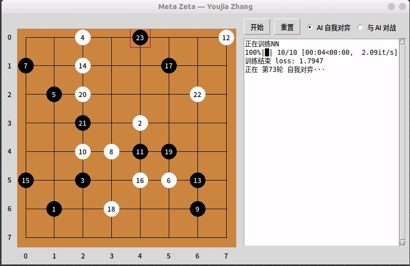

<h1 align="center">Meta-Zeta</h1>

<p align="center">


</p>

- Do you like to play **Gobang** ?
- Do you want to know how **AlphGo Zero** works ?
- Check it out!

## View a Demo
这是一个基于强化学习的自我博弈模型，运行后的程序如下所示。

<div align=center>

</div>

---
## Quick Start
```
python3 MetaZeta.py
```
### Train
我们构建了一个基于**MCTS**进行决策的 **AI玩家**，由**残差神经网络**辅助预测落子。
- 操作：点击 `AI 自我对弈`，在右上角点击 `开始`

### Test
我们可以和训练有素的 **AI玩家** 对弈，以测试 AI 的下棋水平。
- 操作：点击 `与 AI对战`，在右上角点击 `开始`

### Environment
- Ubuntu 18.04.6 LTS
- tensorflow-gpu==2.6.2

---
## File Structure
|filename|type|description|     
|-|-|-|
|`TreeNode.py`|**MCTS**| nodes of the MCTS decision tree| 
|`MCTS.py`|**MCTS**|Build MCTS decision tree|  
|`AIplayer.py`|**MCTS**|Build an AI based on MCTS+NN|  
|`Board.py`|**Board**|store board information| 
|`Game.py`|**Board**|defines the game process for selfPlay and play-with-Human|  
|`PolicyNN.py`|**NN**|constructs a residual neural network| 
|`MetaZeta.py`|**Main**|GUI synthesis for all parties All in one| 

---
## How it works (with code explanation)
### 1. [Board design](docs/Board.md)
首先，我们需要设计一些规则来描述棋盘上的信息

### 2. [Residual Neural Network](docs/PolicyNN.md)
然后，我们需要建立一个残差神经网络 ([Network structure](images/model.png))

### 3. [MCTS](docs/MCTS.md) ✨✨✨
然后，我们需要了解 AI 是如何做出决策的。他是如何积累下棋的知识，并利用学到的知识进行下棋的

### 4. [Reinforcement Learning](docs/RL.md)      
最后，我们需要了解强化学习的整个过程（即自我对弈 ）


