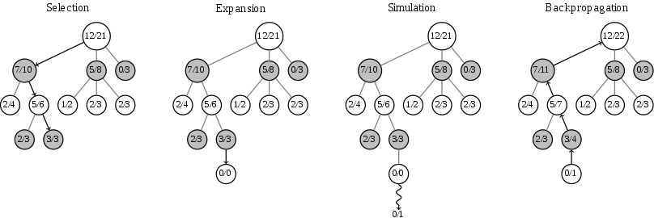

# MCTS
蒙特卡洛树搜索（**M**onte **C**arlo **T**ree **S**earch，**MCTS**）是一种启发式搜索算法，由Coulom在2006年首次提出。他在传统的树形搜索算法的基础上采用了 **蒙特卡洛方法** 进行价值评估，从当前状态开始不断进行随机模拟，然后计算出平均回报率作为对当前状态的估计。搜索有选择地进行迭代，根据估计值加深搜索级别的数量。

<div align=center>

</div>

## 主要步骤
### 选择
从根节点(root)出发，递归地调用 **子节点选择策略** 向搜索树的下方延伸，直到访问到一个终止节点或从未访问过的子节点截止。子节点选择策略也被称为树策略（Tree Policy），通常使用表达式（如下）作为选择依据。

```
TreeNode.py

def select(self, factor):
    """
    选择：根据《策略》选择落子动作
    """
    # 选择所有孩子中《分数》最高
    #  act_node[1] <TreeNode>
    return max(self.children.items(), key=lambda act_node: act_node[1].getValue(factor))

def getValue(self, factor):
    """
    计算每个节点的《价值》，用以选择
    """
    self.U = (factor * self.P *np.sqrt(self.father.N_visits) / (1 + self.N_visits))
    return self.Q + self.U
```
=\\textbf{max}(Q_i+U_i),i=leaf_{each-one})     
        
N_{visit}]^{1/2}}{N_{visit}+1})      

<!-- $$f_{select}(x) = \textbf{max}(Q_i+U_i),i=leaf_{each-one}$$
$$Q_{new}=Q_{old}+\frac{Value_{leaf}-Q_{old}}{N_{visit}}$$
$$U=a·P·\frac{[(hisFather's)N_{visit}]^{1/2}}{N_{visit}+1}$$ -->

其中  是该节点的估计价值， 是神经网络预测的第  个值，也就是落子此处未来的收益有多大， 是该节点的访问次数， 是此节点的落子概率（神经网络预测的第  个值）， 是平衡因子， 就是代码中的 `factor` 变量，是一个从  到正无穷的调节因子。

 跟访问次数有关，没有被访问过的节点会被优先考虑，也是增强了探索广度。

- 如果 `factor` 越小，MCTS 搜索中的探索广度就越低，对神经网络预测的先验概率  的关注就越少。如果 `factor` 太大，探索广度就太高了，它太依赖于神经网络预测的先验概率 ，它不太重视 MCTS 模拟积累得到的结果。因此，需要一个合理折中的 factor 值。

### 扩展
如果当前节点是叶子节点（无子），则根据当前节点的所有可能的《动作》添加一个或多个子节点。    
扩展节点需要提供两个值：`action`，`prob`
```
TreeNode.py

def expand(self, action_priors):
    """
    扩展：增加叶子节点的孩子
    """
    # action_priors：(落子动作a，该位置的概率p)
    for action, prob in action_priors:
        if action not in self.children:
            self.children[action] = TreeNode(self, prob)
```
`action`，`prob` 都是通过神经网络根据当前的棋盘预测出来的结果。

### 模拟
传统的 MCTS 就是通过蒙特卡洛方法随机采样来预测 `action`，`prob`。     
这里我们使用残差网络进行预测。因为神经网络可以积累学习到的知识。

### 更新
 是神经网络预测的价值收益。将叶子节点的 ，沿着路径自下而上的向上传播，更新沿途每个节点的估值信息。
```
TreeNode.py

def update(self, leaf_value):
    """
    更新：更新节点的数值
    """
    # leaf_value: 从当前选手的身份《评估》叶子节点的价值，也就是走这一步预计带来的收益。
    self.N_visits += 1
    self.Q += 1.0*(leaf_value - self.Q) / self.N_visits

def updateRecursive(self, leaf_value):
    """
    回溯：递归更新从叶子到根上的所有节点
    """
    # 如果这个节点是有父亲，优先更新该节点的父亲
    if self.father:
        ···
        self.father.updateRecursive(-leaf_value)
    self.update(leaf_value)
```

## MCTS类
