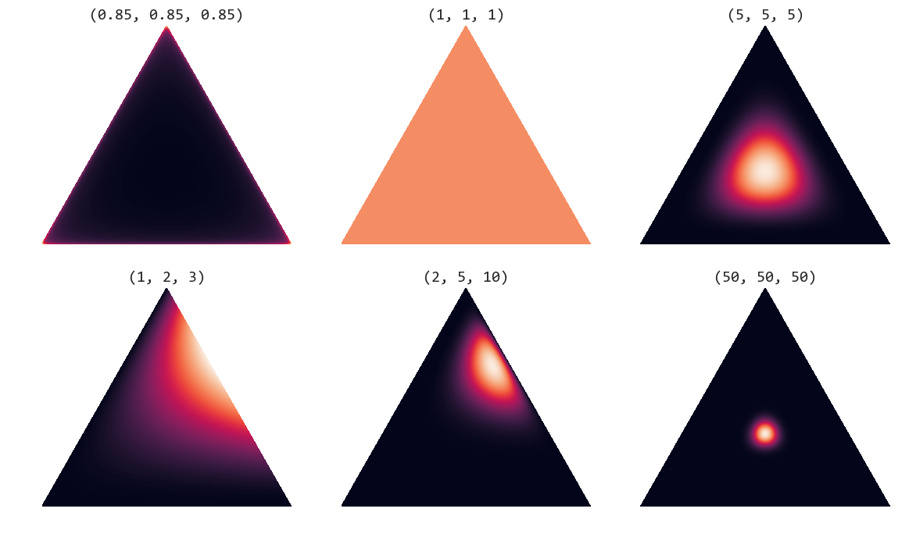

# MCTS
蒙特卡洛树搜索（**M**onte **C**arlo **T**ree **S**earch，**MCTS**）是一种启发式搜索算法，由Coulom在2006年首次提出。他在传统的树形搜索算法的基础上采用了 **蒙特卡洛方法** 进行价值评估，从当前状态开始不断进行随机模拟，然后计算出平均回报率作为对当前状态的估计。搜索有选择地进行迭代，根据估计值加深搜索级别的数量。

<div align=center>

</div>

## 1 主要步骤
### 1.1 选择
从根节点(root)出发，递归地调用 **子节点选择策略** 向搜索树的下方延伸，直到访问到一个终止节点或从未访问过的子节点截止。子节点选择策略也被称为树策略（Tree Policy），通常使用表达式（如下）作为选择依据。

```
TreeNode.py

def select(self, factor):
    """
    选择：根据《策略》选择落子动作
    """
    # 选择所有孩子中《分数》最高
    #  act_node[1] <TreeNode>
    return max(self.children.items(), key=lambda act_node: act_node[1].getValue(factor))

def getValue(self, factor):
    """
    计算每个节点的《价值》，用以选择
    """
    self.U = (factor * self.P *np.sqrt(self.father.N_visits) / (1 + self.N_visits))
    return self.Q + self.U
```
=\\textbf{max}(Q_i+U_i),i=leaf_{each-one})     
        
N_{visit}]^{1/2}}{N_{visit}+1})      

<!-- $$f_{select}(x) = \textbf{max}(Q_i+U_i),i=leaf_{each-one}$$
$$Q_{new}=Q_{old}+\frac{Value_{leaf}-Q_{old}}{N_{visit}}$$
$$U=a·P·\frac{[(hisFather's)N_{visit}]^{1/2}}{N_{visit}+1}$$ -->

其中  是该节点的估计价值， 是神经网络预测的第  个值，也就是落子此处未来的收益有多大， 是该节点的访问次数， 是此节点的落子概率（神经网络预测的第  个值）， 是平衡因子， 就是代码中的 `factor` 变量，是一个从  到正无穷的调节因子。

 跟访问次数有关，没有被访问过的节点会被优先考虑，也是增强了探索广度。

- 如果 `factor` 越小，MCTS 搜索中的探索广度就越低，对神经网络预测的先验概率  的关注就越少。如果 `factor` 太大，探索广度就太高了，它太依赖于神经网络预测的先验概率 ，它不太重视 MCTS 模拟积累得到的结果。因此，需要一个合理折中的 factor 值。

### 1.2 扩展
如果当前节点是叶子节点（无子），则根据当前节点的所有可能的《动作》添加一个或多个子节点。    
扩展节点需要提供两个值：`action`，`prob`
```
TreeNode.py

def expand(self, action_priors):
    """
    扩展：增加叶子节点的孩子
    """
    # action_priors：(落子动作a，该位置的概率p)
    for action, prob in action_priors:
        if action not in self.children:
            self.children[action] = TreeNode(self, prob)
```
`action`，`prob` 都是通过神经网络根据当前的棋盘预测出来的结果。

### 1,3 模拟
传统的 MCTS 就是通过蒙特卡洛方法随机采样来预测 `action`，`prob`。     
这里我们使用残差网络进行预测。因为神经网络可以积累学习到的知识。

### 1,4 更新
 是神经网络预测的价值收益。将叶子节点的 ，沿着路径自下而上的向上传播，更新沿途每个节点的估值信息。
```
TreeNode.py

def update(self, leaf_value):
    """
    更新：更新节点的数值
    """
    # leaf_value: 从当前选手的身份《评估》叶子节点的价值，也就是走这一步预计带来的收益。
    self.N_visits += 1
    self.Q += 1.0*(leaf_value - self.Q) / self.N_visits

def updateRecursive(self, leaf_value):
    """
    回溯：递归更新从叶子到根上的所有节点
    """
    # 如果这个节点是有父亲，优先更新该节点的父亲
    if self.father:
        ···
        self.father.updateRecursive(-leaf_value)
    self.update(leaf_value)
```
---
## 2 MCTS类
`TreeNode.py` 中已经将 MCTS 的基本动作设计完成，然后设计 `MCTS.py`。**MCTS类主要是为AI做出落子决策。**

### 2.1 推演
```
MCTS.py

def playout(self, state):
    """
    推演： 从根到叶进行推演，在叶上获取一个值，并通过其父级将其传播回来。
    """
    node = self.root
    while True:
        # 如果，是叶子节点就跳出
        if node.isLeaf():
            break
        # 否则
        #   就选择该节点所有孩子中《分数》最高的。
        #       action：落子动作
        #       node：孩子节点
        action, node = node.select(self.fator)
        state.do_move(action)
    # ---------------------------------------------------
    # 在原本的MCTS中，《评估》操作采用蒙特卡洛的方法，通过随机下棋
    # 模拟走完一次完整棋局 (称为 rollout), 得到胜负结果。模拟的结果反应在 leaf_value 变量中
    # ---------------------------------------------------
    # 根据当前的《状态(棋盘)》使用神经网络预测：下一步所有的动作以及
    # 对应的概率 + 此步未来的收益
    action_probs, leaf_value = self.policy_NN(state)

    # 检查一下当前《状态》是不是已经分出胜负
    gameOver, winner = state.gameIsOver()

    # 如果这盘棋还没结束
    if not gameOver:
        # 扩展当前节点
        node.expand(action_probs)
    else:
        # 平局
        if winner == -1:
            leaf_value = 0.0
        else:
            # 如果《模拟/预测》的结果，获胜的是当前的玩家，+1分 否则 -1分
            leaf_value = (
                1.0 if winner == state.getCurrentPlayer() else -1.0
            )
    
    # 根据神经网络的预测结果 leaf_value
    # 自下而上《更新》叶子
    node.updateRecursive(-leaf_value)
```
推演（`playout`）就是一整套 MCTS 动作，**选择-->模拟-->扩展-->更新**。
```
action_probs, leaf_value = self.policy_NN(state) #此处体现了神经网络是如何指导蒙特卡罗搜索的。
```

### 2.2 落子
```
MCTS.py

def getMoveProbs(self, state, flag_is_train):
    """
    获取落子依据：按顺序进行所有推演(playout)，并返回可用操作(落子)及其相应的概率。
    """
    # state：当前游戏棋盘的状态。
    # 在（0，1）中控制探测(exploration)程序
    exploration = 1.0 if flag_is_train else 1e-3

    # 根据当前棋盘状态，经过 simulations 次数的模拟
    # 构建出了一个 MCTS 树，根节点是依托于当前棋盘。
    for _ in range(self.simulations):
        state_copy = copy.deepcopy(state)
        self.playout(state_copy)

    # 根据 MCTS 根节点，获取下一步落子的决策
    act_visits = [(act, node.N_visits) for act, node in self.root.children.items()]
    acts, visits = zip(*act_visits)
    act_probs = softmax(1.0/exploration * np.log(np.array(visits) + 1e-10))

    # 落子的位置 + 每一个位置的胜率
    return acts, act_probs
```

其中 `simulations` 为推演的次数，根据大数定律推演的次数越多，对未来的估计就会越准确（**大数定律**）。但是尽管当推演次数足够多时，该算法会收敛，但收敛速度不佳。当推演结束之后，就可以获取根节点（root）所有孩子中得分最高的那个地方行动（落子）。

### 2.3 继承&更新 root
```
def updateMCTS(self, move):
    if move in self.root.children:
        # 延续这棵树，更新树根
        self.root = self.root.children[move]
        self.root.father = None
    else:
        # 只有当整个对局结束，才重置整棵MCTS
        self.root = TreeNode(None, 1.0)
```
- 在AI自我对弈中，只有当对弈结束时，MCTS才会初始化，否则就会一直沿用同一颗树进行落子决策 **《同一个人左右互搏》**
- 在于AI对战过程中，AI每走一步就根据当前棋盘建立一棵树，树高为2（root + children），选择一处进行落子，并使 MCTS 才会初始化。

---
## 3 AI player
封装一个完整的AI玩家 主要的动作就一个《落子》
### 3.1 落子
```
def getAction(self, board, flag_is_train):
    # 获得当前棋盘中可以落子的地方
    emptySpacesBoard = board.availables

    # move_probs 的尺寸是整个棋盘的大小
    # 每一个格子上存放着此处落子的概率
    move_probs = np.zeros(board.width * board.height)

    if len(emptySpacesBoard) > 0:
        # 基于 MCTS 获取下一步的落子行为，以及对应每一个位置胜率
        acts, probs = self.MCTS.getMoveProbs(board, flag_is_train)
        move_probs[list(acts)] = probs
        
        if flag_is_train:
            # 添加《Dirichlet Noise》进行探索（自我对弈训练所需）
            move = np.random.choice( # 随机抽取
                acts, # 落子行为
                p=0.75*probs + 0.25*np.random.dirichlet(0.3*np.ones(len(probs)))
            )
            # 自下而上更新根节点并重用 MCTS
            # AI 相当于是《同一个人左右互搏》使用同一棵MCTS进行对我对弈
            self.MCTS.updateMCTS(move)

        else:
            # 非训练
            # ------------------------------------
            # 更新根节点并使用默认的temp=1e-3重用搜索树
            # 这几乎等同于选择prob最高的移动
            move = np.random.choice(acts, p=probs)
            # 重置 MCTS
            self.MCTS.updateMCTS(-1)
        
        # 依据概率选择下一步落子的位置，以及当前棋盘的所有位置的概率（分布）
        return move, move_probs
    else:
        print("WARNING: the board is full")
```
值得一提的是，当AI根据当前的棋盘获取了全局落子决策的时候，AI不是简单进行依概率 `probs` 采样，而是加入了 **《Dirichlet Noise》** 。
- 噪声比为：没有任何噪声，这可能使得训练期间的广度探索的程度很低，不能完全搜寻巨大的状态空间，导致最终性能不佳。
- 噪声比为：可能是噪声比例太大，AI无法起到“深入钻研”的效果，精力太过分散。

所以我们需要选择合适的噪声比例。

#### 附录
<div align=center>

</div>

> The Dirichlet distribution is parameterised by the vector α, which has the same number of elements K as our multinomial parameter θ. So you can interpret p(θ|α) as answering the question “what is the probability density associated with multinomial distribution θ, given that our Dirichlet distribution has parameter α.”

<div align=center>

</div>

>PS: Dirichlet distribution on a 2-simplex (equilateral triangle) for different values of α.