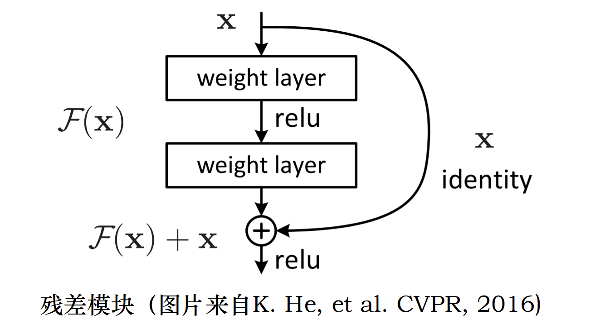

# 神经网络
主要是辅助 MCTS 进行决策，神经网络的学习过程可以积累棋盘知识，便于复用。**TensorFlow**
## 1 残差网络

<div align=center>

</div>

### 1.1 基本层-模块化
```
PolicyNN.py  Class: ResidualCNN

# 卷积层模板
def ConvLayer(self, input_block, filters, kernel_size):
    output = Conv2D(
        filters = filters,              # 卷积滤波器个数
        kernel_size = kernel_size,      # 卷积滤波器的尺寸 (3,3),(5,5)
        data_format="channels_first",   # 表示输入张量中维度的顺序
        padding = 'same',               # 边缘填充
        use_bias=False,                 # 该层是否使用偏置向量
        activation='linear',            # 线性激活函数
        kernel_regularizer = l2(self.L2) # L2正则化项
    )(input_block)
    output = BatchNormalization(axis=1)(output) # 批量标准化层 
    output = LeakyReLU()(output)
    return (output)、

# 残差卷积层模板
def ResLayer(self, input_block, filters, kernel_size):
    output = Conv2D(
        filters = filters,              # 卷积滤波器个数
        kernel_size = kernel_size,      # 卷积滤波器的尺寸 (3,3),(5,5)
        data_format="channels_first",   # 表示输入张量中维度的顺序
        padding = 'same',               # 边缘填充
        use_bias=False,                 # 该层是否使用偏置向量
        activation='linear',            # 线性激活函数
        kernel_regularizer = l2(self.L2) # L2正则化项
    )(input_block)
    output = BatchNormalization(axis=1)(output) # 批量标准化层 
    output = LeakyReLU()(output)                # 激活函数

    output = Conv2D(
        filters = filters,              # 卷积滤波器个数
        kernel_size = kernel_size,      # 卷积滤波器的尺寸 (3,3),(5,5)
        data_format="channels_first",   # 表示输入张量中维度的顺序
        padding = 'same',               # 边缘填充
        use_bias=False,                 # 该层是否使用偏置向量
        activation='linear',            # 线性激活函数
        kernel_regularizer = l2(self.L2) # L2正则化项
    )(output)
    output = BatchNormalization(axis=1)(output) # 批量标准化层 
    output = add([input_block, output])         # 拼接输入各个张量的和
    output = LeakyReLU()(output)                # 激活函数
    return (output)
```
### 1.2 预测对象

 是神经网络预测的第  个值。也就是在棋盘的某一处落子，未来的收益是多少（赢或者输）。  

 是神经网络预测的第  个值。落子概率分布，有些地方概率大表示《NN认为此处更应该落子》。

```
PolicyNN.py  Class: ResidualCNN

def ValueHead(self, output):
    conv = Conv2D(
        filters = 1 ,                  
        kernel_size = (1,1) , 
        data_format="channels_first" , 
        padding = 'same', 
        use_bias=False, 
        activation='linear', 
        kernel_regularizer = l2(self.L2)
    )(output)
    conv = BatchNormalization(axis=1)(conv)
    conv = LeakyReLU()(conv)
    flatten = Flatten()(conv)

    dense = Dense(
        32, # 输出空间维度
        use_bias=False, 
        activation='linear', 
        kernel_regularizer=l2(self.L2)
    )(flatten)
    dense = LeakyReLU()(dense)
    dense = Dense(
        1, 
        use_bias=False, 
        activation='tanh', 
        kernel_regularizer=l2(self.L2), 
        name = 'ValueHead'
    )(dense)
    return (dense)

def PolicyHead(self, output):
    conv = Conv2D(
        filters = 2, 
        kernel_size = (1,1), 
        data_format="channels_first", 
        padding = 'same', 
        use_bias=False, 
        activation='linear', 
        kernel_regularizer = l2(self.L2)
    )(output)
    conv = BatchNormalization(axis=1)(conv)
    conv = LeakyReLU()(conv)
    conv = Flatten()(conv)
    dense = Dense(
        self.output_dim, 
        use_bias=False, 
        activation='softmax', 
        kernel_regularizer=l2(self.L2), 
        name = 'PolicyHead'
    )(conv)
    return (dense)
```
### 1.3 损失函数
```
PolicyNN.py  Class: ResidualCNN

model.compile(
    loss={
        'ValueHead': 'mean_squared_error', 
        'PolicyHead': 'categorical_crossentropy'
    },
    optimizer=Adam(),	
    loss_weights={
        'ValueHead': 0.5, 
        'PolicyHead': 0.5
    })
```
-  应该和真实的输赢收益越接近越好，采用 MSE 损失。    
-  应该和真实的概率分布越接近越好，采用 Cross-Entropy 损失。

## 2 决策网络
决策网络主要的核心还是我们构建的残差网络。由于我们的训练数据集是根据《自我对弈》动态生成的，所以我们还得 **良好** 的存储所收集的数据。

**数据池**。我们始终维护这个数据池的大小（`trainDataPoolSize`）不变，将新产生的数据加入到数据池中，如果数据池已经满了就会删除掉最久的数据以空出位置。在每次训练神经网络时，我们没有直接使用前一轮自我对弈产生的数据进行训练，而是从数据池中随机地选择（`random.sample`）一批数据（大小为 `trainBatchSize`）进行训练。由于大部分抽样数据来自于不同的游戏回合，数据之间的相关性在一定程度上得到了解决。同时，这种方法还可以解决策略的非静止分布问题。使用单轮下棋产生的数据所学到的策略分布之间可能有很大的差异。但如果数据是由多轮比赛产生的，结果就会在一定程度上趋于平稳。

**学习率更新**。根据 **KL散度** 变化情况调整、或根据损失变化调整学习率。

### 2.1 主要变量
```
trainDataPoolSize = 18000*2 # 用以存储训练网络的数据
trainBatchSize = 1024*2     # 每次从数据池(trainDataPool)中随机采样出的一批训练数据

trainDataPool = deque(maxlen=trainDataPoolSize) # 训练数据池

kl_targ = 0.02
learningRate = 2e-3 # 学习率 
LRfctor = 1.0       # 适应性地调整学习率
```
### 2.2 主要函数
```
PolicyNN.py  Class: PolicyValueNet

def get_DataAugmentation(self, play_data):
    """
    通过旋转和翻转来增加数据集
    play_data: [(棋盘状态, 落子概率, 胜者预测), ..., ...]
    """
    # 扩展之后的数据集
    extendData = []
    for board, porbs, winner in play_data:
        for i in [1, 2, 3, 4]:
            # 逆时针旋转
            # -------------------------------------------------
            # 旋转每一个棋盘棋子状态
            equi_board = np.array([np.rot90(b,i) for b in board])
            # 旋转每一个棋盘上的概率分布
            equi_porbs = np.rot90(np.flipud(porbs.reshape(self.input_dim[1], self.input_dim[2])), i)
            extendData.append((equi_board, np.flipud(equi_porbs).flatten(), winner)) # 扩展数据
            
            # 水平翻转
            # -------------------------------------------------
            equi_board = np.array([np.fliplr(s) for s in equi_board])
            equi_porbs = np.fliplr(equi_porbs)
            extendData.append((equi_board, np.flipud(equi_porbs).flatten(), winner)) # 扩展数据


def memory(self, play_data):
    """
    存储训练数据
    play_data: [(棋盘状态, 落子概率, 胜者预测), ..., ...]
    """
    # 将收集到的自我对弈数据进行《数据增强》
    play_data = self.get_DataAugmentation(list(play_data)[:])
    self.trainDataPool.extend(play_data) # 加入训练数据池中


def update(self, scrollText):
        """
        更新预测网络的参数
        """
        # 从数据池中随即采样一批数据进行训练
        trainBatchSize = random.sample(self.trainDataPool, self.trainBatchSize)
        
        # trainBatchSize 三元组
        # 棋盘状态 + 落子概率分布 + 胜者预测
        batchBoard  = [data[0] for data in trainBatchSize]
        batchProbs  = [data[1] for data in trainBatchSize]
        batchWinner = [data[2] for data in trainBatchSize]

        # 返回这一批训练数据样本的模型预测值
        # 也就是首先记录下当前模型的预测水平
        batchProbsOld, batchValueOld = self.model.predict_on_batch(np.array(batchBoard))

        pbar = tqdm(range(self.epochs),ncols=35)
        for epoch in pbar:
            ···
            # 根据这批训练数据，对模型进行训练
            loss = self.train(batchBoard, batchProbs, batchWinner, self.learningRate*self.LRfctor)

            # 返回训练之后模型预测值
            batchProbsNew, batchValueNew = self.model.predict_on_batch(np.array(batchBoard))

            # 计算Kullback-Leibler散度 恒两个前后两次 概率分布预测值的差异
            kl = np.mean(np.sum(batchProbsOld * (np.log(batchProbsOld + 1e-10) - np.log(batchProbsNew + 1e-10)),axis=1))
            if kl > self.kl_targ * 4:  # 如果KL散度严重发散，则提前停止使用
                break

        # 更新学习率
        if kl > self.kl_targ * 2 and self.LRfctor > 0.1:
            self.LRfctor /= 1.5
        elif kl < self.kl_targ / 2 and self.LRfctor < 10:
            self.LRfctor *= 1.5
        
        return loss
```
### 附
<div align=center>

</div>

> In mathematical statistics, the Kullback–Leibler divergence, (also called relative entropy), is a measure of how one probability distribution is different from a second, reference probability distribution.

