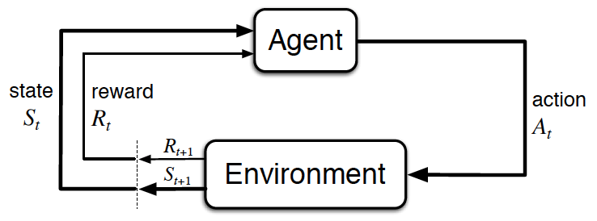

# 强化学习
AlphaGo Zero中的深度神经网络，使用强化学习算法在自我对弈的过程中进行训练。对于每个棋面 , 使用前一轮得到的神经网络  来指导MCTS。MCTS会输出每一步走棋的概率分布 **π**。搜索概率 π 比单纯的神经网络输出  概率分布更好，能够选择更强的走棋。从这个角度来说，MCTS可以看做是 Policy Iteration 算法中的策略提升操作（policy improvement operator）。这意味着，在自我对弈过程中，不断使用提升过的、基于 MCTS 的策略 π 来进行决策走棋，最终会决出胜负，将最终的获胜方z作为一个样本值，可以看做是 Policy Iteration 中的策略评估操作（policy evaluation operator），即对当前棋面局势的评估，作为当前棋面下，获胜概率的预测值。这里强化学习算法的关键是在 Policy Iteration过程中，不断重复地使用 policy improvement 和 policy evaluation。蒙特卡罗搜索结束后，更新  的参数θ，使得更新完的  的输出：移动概率和预测值 =f(s))，能够更加接近MCTS得到的搜索概率和自我对弈的获胜方(π,z)。这个新的  将在下一轮自我对弈中继续指导MCTS，使得其变得更健壮。

## 1 数据产生过程
对于  时刻下的棋盘状态 ，MCTS 可以模拟得到下一步落子的概率分布 **π**，不断对弈一直分出胜负得到回报分数 ，()，将这个分数反馈到了每一个  的  上，且满足  （正负号取决于当前对局最终的获胜者），那么我们就得到了一组训练数据(,πt,)，一场比赛会产生很多训练数据，我们将  作为  的输入，(πt,)作为标签，使得  的输出(,)趋近于(πt,)。 相当于告诉 AI 应该这盘对弈中应该强化那些落子决策，以及弱化那些落子决策。

## 2 决策优化过程
 首先使用随机权重 θ 进行初始化。在后续每一轮迭代  中（每轮迭代对应若干局完整的围棋对弈）， 使用强化学习算法 Policy Iteration 进行训练优化，该强化学习算法将 MCTS 纳入训练过程，用前一轮的神经网络 (θi-1)在该轮迭代i的每个时间步  来指导 MCTS 模拟得到 πt=α(θi−1,)，直到时间步T产生胜负，按照上述描述（**数据产生过程**）来构造该轮对弈产生的数据(,πt,)。接着，(θi)使用该训练数据进行参数更新，目标是使得新的 (θi+1)的输出(,)= (θi+1,)能够拟合(π,)，也即最小化  和  之间的误差，最大化  和 π 之间的相似性。优化损失函授结合了 MSE 和 Cross-Entropy Loss（还包括正则化项）

